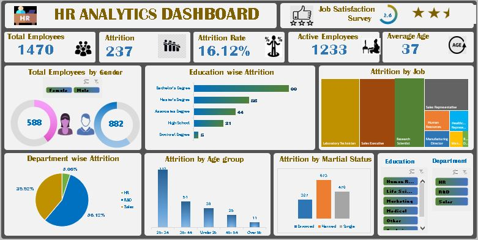

# HR Data Analytics Portfolio - Microsoft Excel

# Project Introduction: 
In the rapidly evolving business environment, effective HR management plays a critical role in organizational success. My HR Data Analytics portfolio project aims to provide insights into key HR metrics, facilitating informed decision-making for HR teams. The project focuses on the following Key Performance Indicators (KPIs):

- Total Employees Count: Understanding the workforce size.
- Attrition Rate & Count: Monitoring the rate at which employees leave the organization.
- Active Employees: Tracking the number of currently active employees.
- Average Age: Analyzing the age distribution within the workforce.

This project delves into several critical areas, including total employees by gender, education-wise attrition, attrition by age, department-wise attrition, attrition by age group, and attrition by marital status. Additionally, interactive slicers for gender, education, and department have been incorporated to enhance data exploration and visualization.

# Key Insights:

- Total Employees by Gender: 
    Insight into gender distribution to guide diversity and inclusion efforts.
- Education-Wise Attrition:
    Identification of higher turnover rates among specific educational groups, informing targeted retention strategies.
- Attrition by Age:
    Analysis of age-related turnover trends, aiding in the development of age-specific engagement initiatives.
- Department-Wise Attrition:
    Identification of departments with higher turnover rates, enabling targeted interventions to improve job satisfaction.
- Attrition by Age Group:
    Detailed insights into which age cohorts are most affected by attrition, allowing for focused retention efforts.
- Attrition by Marital Status:
    Analysis of turnover trends based on marital status, informing supportive policies and programs.

# Tools and Technologies
- <h5>Microsoft Excel:</h5>Used for data cleaning, preprocessing, and dashboard creation.
- <h5>Visualization Techniques:</h5> Implementation of various charts and graphs to effectively communicate findings.
- <h5>Interactive Slicers:</h5> Added for gender, education, and department to enhance data exploration.

# Dashboard

 

By harnessing the power of data analytics, this project  empowers HR professionals with actionable insights, enabling them to optimize HR strategies, enhance employee retention, and support the overall growth and well-being of the organization.